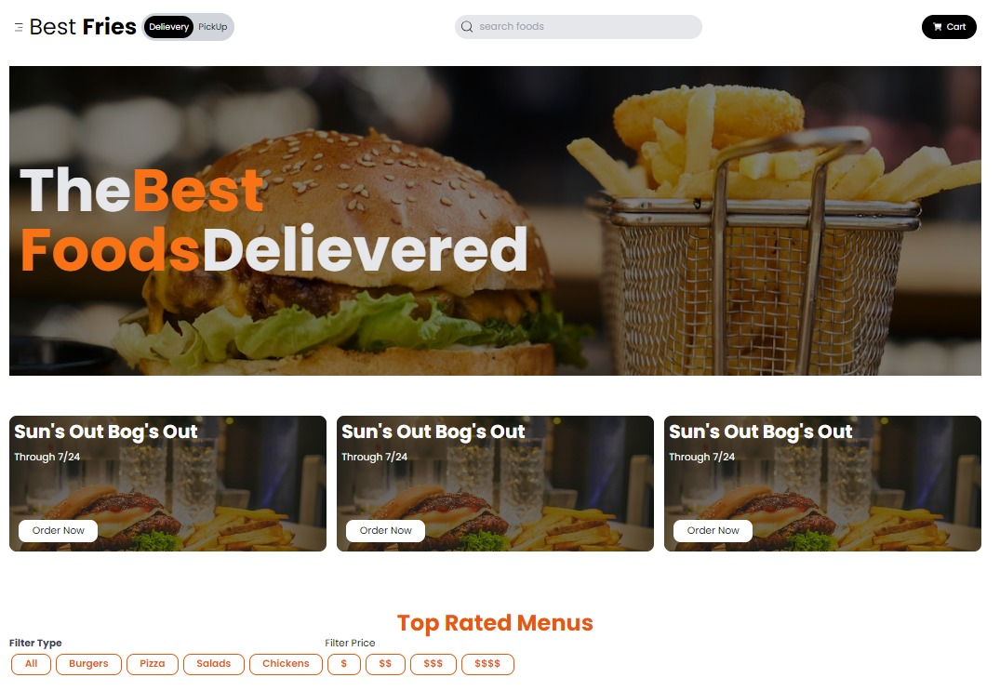
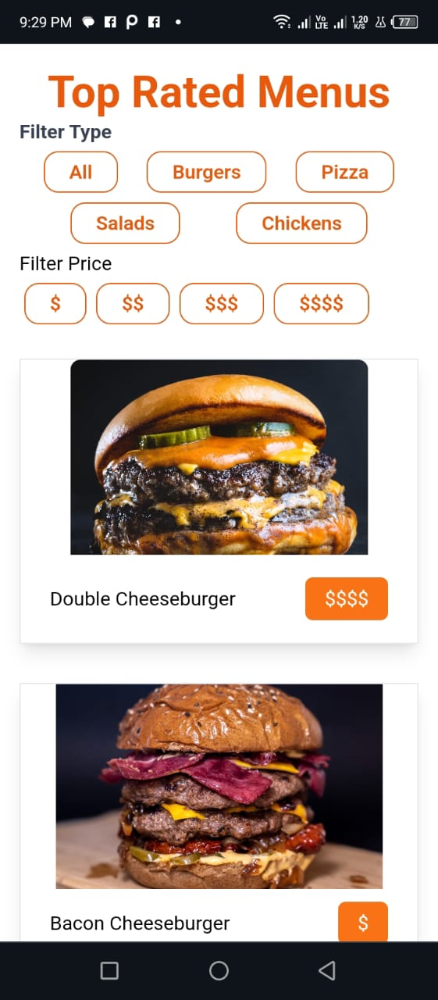
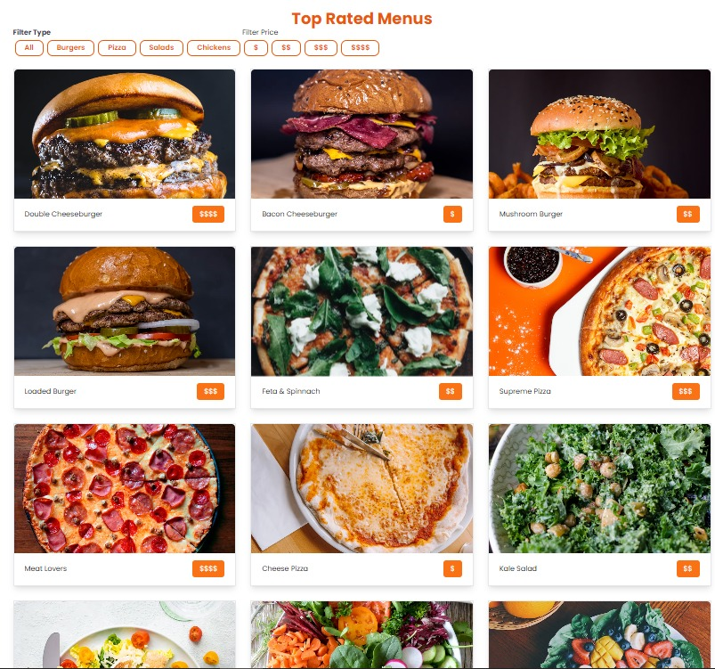
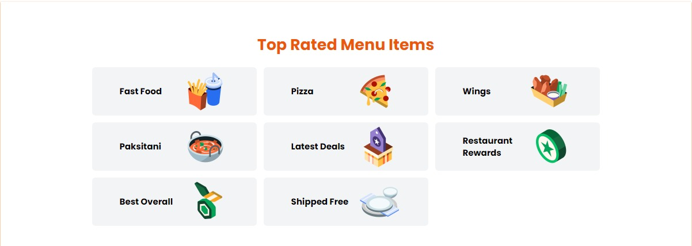

# Crust N Slice

This project is a responsive web application built with React and styled using Tailwind CSS. It serves as a platform for customers to conveniently have their favorite fast food items such as burgers, pizzas, and fries at any store.

## Description
The Fast Food Ordering Website provides a user-friendly interface for customers to browse through a variety of delicious fast food options and place their orders with ease. Whether craving a juicy burger, a mouthwatering pizza, or crispy fries, this website has it all covered.

## Table of Contents

## Projects Screenshots

### Hero Section
Hero Section

 
### Menu
Menu Section on Mobile

Menu Section on Laptop

### Categories
Categories Section on Mobile

Categories Section on Laptop

 
 